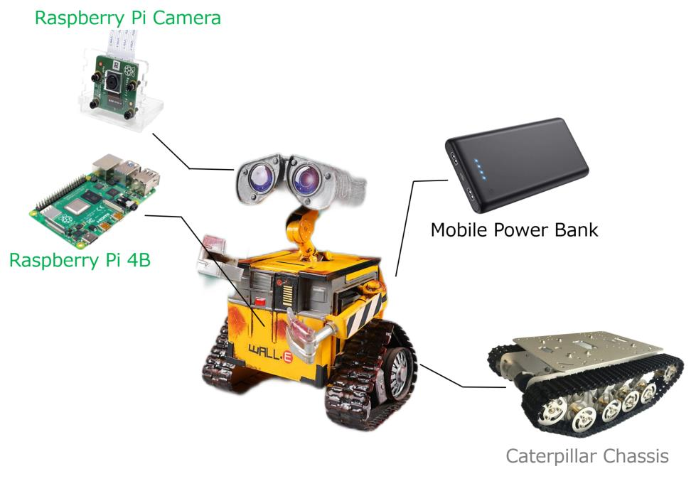
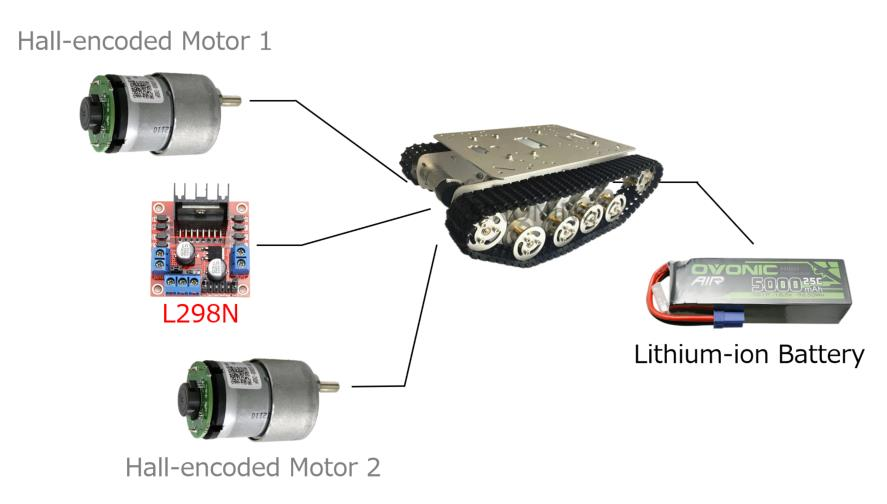

# laotie_robot

The Laotie(old fan) robot is a open source, easy-to-ues, low-cost project aiming to help programming beginners learn the fundamentals.

## Features

- voice-activated camera
- voice-controlled navigation
- speech interaction
- coming soon ...

## Caterpillar Chassis

## A full list of hardwares(coming soon ...)

