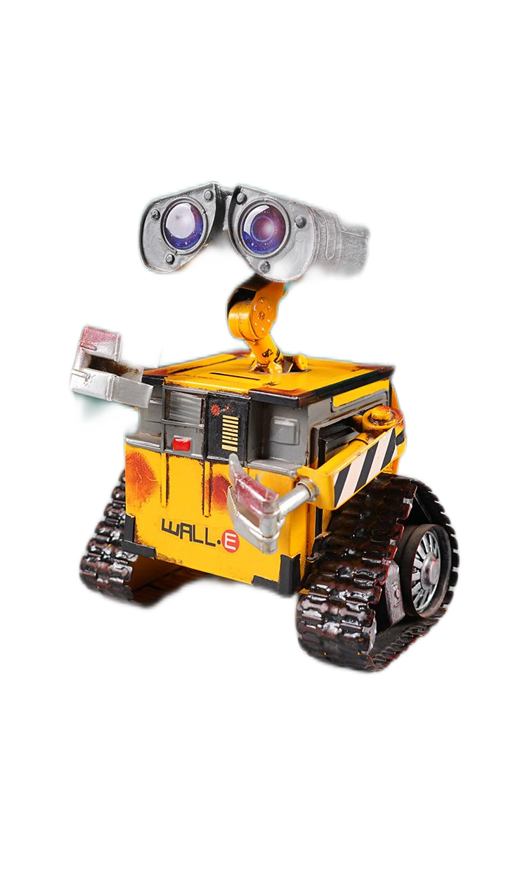
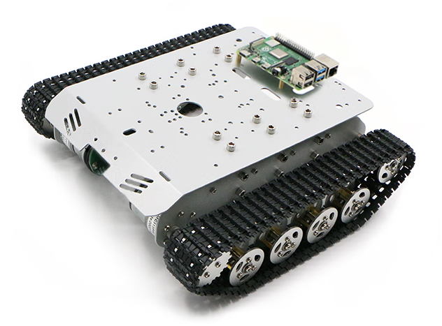

# laotie_robot
The Laotie(old fan) robot is a Raspberry Pi 4B based robot with caterpillar chassis, Pi camera, Pi Microphone, Google Coral USB accelerator.

## Features

- voice activated camera
- human face recognition
- caterpillar chassis
- chatbot

## Hardware(click to get e-shop/website URLs)

1. [Raspberry Pi 4B](https://www.raspberrypi.com/products/raspberry-pi-4-model-b/)

   
   
2. [Google Coral USB Accelerator](https://coral.ai/docs/accelerator/get-started/)
   
   

3. [A Wall-E shaped paper napkin box](https://m.tb.cn/h.UiALZrQ?tk=NWVtdd18cqF)

   

4. [Raspberry Pi Camera](https://m.tb.cn/h.U73LXS3?tk=d0y0dd17L5D)

5. [Raspberry Pi Microphone](https://item.m.jd.com/product/10035607476070.html?gx=RnFlkWdbOT3RyNRP--tyW8shC5U_YRfuEl-Y&ad_od=share&utm_source=androidapp&utm_medium=appshare&utm_campaign=t_335139774&utm_term=CopyURL)

6. [Caterpillar Chassis](https://item.m.jd.com/product/10044934642439.html?gx=RnFlkWdbOT3RyNRP--tyW8shC5U_YRfuEl-Y&ad_od=share&utm_source=androidapp&utm_medium=appshare&utm_campaign=t_335139774&utm_term=CopyURL)
   
   

